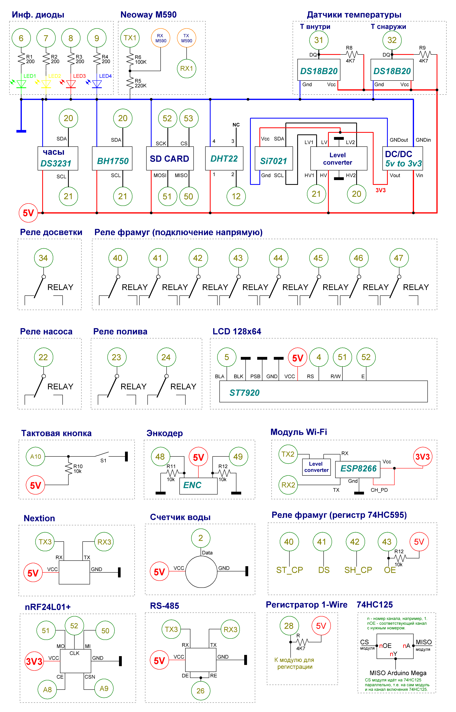

<h1>Arduino based smart greenhouse</h1>

Project WIKI is located <a href="https://github.com/Porokhnya/GreenhouseProject/wiki">here</a> (sorry, still only russian version, but you can help to translate it ;)).

<h1>What the firmware can</h1>

 <ul>
  <li>Send data to IoT (ThingSpeak and <a href="http://gardenboss.ru" target="_blank">GardenBoss.ru</a>);</li>
  <li>Able to control and configure through configuration software and web-based interface;</li>
  <li>Receive and execure external commands from <a href="http://gardenboss.ru" target="_blank">GardenBoss.ru</a>;</li>
  <li>To publish MQTT-topics (in development);</li>
  <li>Can control via SMS;</li>
  <li>Able to use different gates to WAN/LAN: GSM/GPRS (SIM800L/Neoway M590), Wi-Fi (ESP8266), LAN (W5100);</li>
  <li>Able to work with sensors using different ways - connected directly to microcontroller, through RS-485, 1-Wire, nRF;</li>
  <li>Able to be configured by using smart rules - is the key feature of the firmware, where user can provide and manage the needed firmware behaviour;</li>
  <li>Work with different display modela - Nextion, LCD 128x64, (7'-TFT with Arduino Due - in development);</li>
  <li>Work with idfferent microcontrollers: Arduino Mega, Arduino Due and any PCB, based on it;</li>
  <li>Flexible firmware configuration: work through port extenters, include/exclude software modules in the firmware and so on;</li>
  <li>Work with many sensors of many types (humidity, temperature, water flow and so on);</li>
  <li>Compute deltas within two sensors, even different hardware types (for example, compute temperature delta between DS18B20 and DHT22);</li>
  <li>Work with reservation lists;</li>
  <li>Work with universal modules - is the key feature of the firmware, when the sensors connected to universal module PCB, and can be queried through RS-485, 1-Wire, nRF;</li>
  <li>Gather logs to many locations: local file on SD-card, web-based interface, GradenBoss.ru and do on;</li>
<li>Alarm support - when the rule is raised by its conditions - you will receive alarm SMS;</li>
  <li>And many, many tasty features...</li>
 </ul>
 
<h1>ATTENTIONS!</h1>
The firmware needs to be configured through `Globals.h` before upload to the microcontroller! 

<h1>License</h1>

For home use only, any commercial use is strictly prohibited. If you want to use this firmware for commercial purposes - please write to spywarrior@gmail.com for details.

<h1>Project structure</h1>
<ul>
<li><b>Main</b> folder - firmware for the microcontroller;</li>
<li><b>SOFT</b> folder - configuration software, can be connected to microcontroller by using the COM-port;</li>
<li><b>Libraries</b> folder - libraries, using in project, need to be installed in Arduino IDE befoce compiling the firmware;</li>
<li><b>SD</b> folder - this files should be placed on SD card;</li>
<li><b>arduino-1.6.7-windows.exe</b> - Arduino IDE, using for compiling the project;</li>
<li><b>CHANGED_IDE_FILES</b> folder - replace standard Arduino IDE files with this files;</li>
<li><b>NewPlan.spl7</b> file - SPlan 7.0 project with schematic;</li>
<li><b>Nextion</b> folder - firmware for Nextion 320x240;</li>
<li><b>Nextion1WireModule</b> folder - firmware for universal module with Nextion support, for connecting the Nextion through 1-Wire;</li>
<li><b>UniversalSensorsModule</b> folder - firmware for universal module with sensors;</li>
<li><b>UniversalExecutionModule</b> folder - firmware for universal module with execution abilities (translate state of the main controller over supported hardware interfaces);</li>
<li><b>FrequencySoilMoistureSensor</b> folder - firmware for frequency soil moisture sensor support;</li>
<li><b>WEB</b> folder - web-based interface with PHP and sqlite3 support.</li>
</ul>

<h1>Default firmware settings</h1>

Please be attentive - the default firmware settings most likely will not conform your needs! All settings can be changes through Globals.h file in firmware source.

 
<h1>Configuration software screenshoots (while in Russian only, but this will be fixed soon)</h1>

 

<b>Click to view...</b>  

  

<h1>How to use</h1>
<ul>
<li><b>Install the libraries (in Libraries folder) to the Arduino IDE!</b></li>
<li><b>All files from CHANGED_IDE_FILES should be replaced with standard Arduino IDE files!!!</b></li>
<li><b>All firmware settings is located in Globals.h file!</b></li>
</ul>

<h1>EXAMPLE schematic (while in Russian only, but this will be fixed soon)</h1>

<h1>Questions, feedbacks and so on</h1>

Please write to the <a href="mailto:spywarrior@gmail.com">spywarrior@gmail.com</a>
